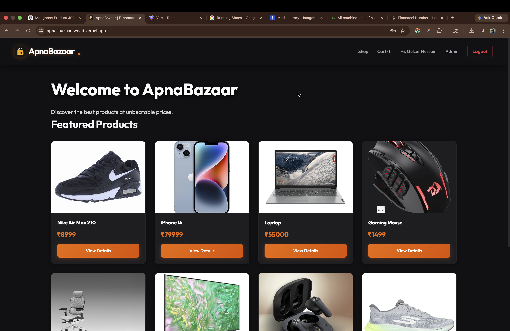
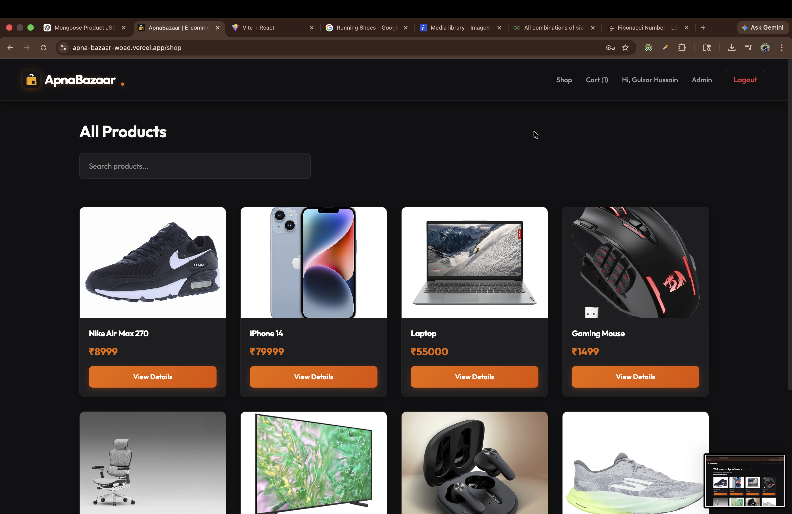
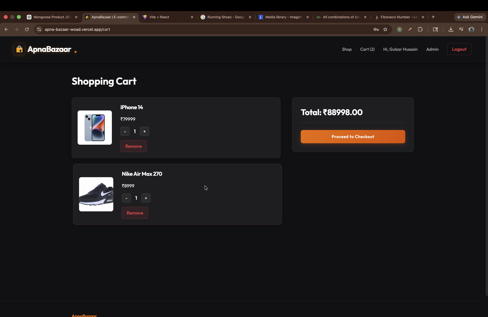

# ApnaBazaar 🛒

A full-stack MERN E-commerce web application built using React, Node.js, Express, and MongoDB.
ApnaBazaar allows users to browse products, upload images, manage carts, and place orders with a responsive and modern UI.

---

## 🚀 Features

* 🔐 User Authentication & Authorization (JWT)
* 🛍 Product Management System
* 🖼 Single & Multiple Image Upload
* 🛒 Add to Cart Functionality
* 📦 Order Management
* 👨‍💼 Admin Dashboard
* 🔍 Product Search & Filtering
* 📱 Fully Responsive Design
* ☁ Cloud Image Storage (Cloudinary/ImageKit)
* ⚡ REST API Integration

---

## 🛠 Tech Stack

### Frontend

* React.js
* Tailwind CSS
* Axios
* React Router DOM

### Backend

* Node.js
* Express.js
* MongoDB
* Mongoose
* JWT Authentication
* Multer

### Deployment

* Vercel
* Render

---

## 📂 Folder Structure

```bash
ApnaBazaar/
│
├── frontend/
│   ├── src/
│   ├── public/
│
├── backend/
│   ├── routes/
│   ├── controllers/
│   ├── models/
│   ├── middleware/
│   ├── config/
│
├── package.json
└── README.md
```

---

## ⚙ Installation

### 1️⃣ Clone Repository

```bash
git clone https://github.com/Gulzar-OP/ApnaBazaar
```

### 2️⃣ Move into Project Folder

```bash
cd ApnaBazaar
```

---

## 🔧 Backend Setup

```bash
cd backend
npm install
```

Create a `.env` file inside backend folder:

```env
PORT=5000
MONGO_URI=your_mongodb_url
JWT_SECRET=your_secret_key

CLOUDINARY_CLOUD_NAME=your_cloud_name
CLOUDINARY_API_KEY=your_api_key
CLOUDINARY_API_SECRET=your_api_secret
```

Run Backend:

```bash
npm run dev
```

---

## 💻 Frontend Setup

```bash
cd frontend
npm install
```

Create a `.env` file:

```env
VITE_API_URL=http://localhost:5000
```

Run Frontend:

```bash
npm run dev
```

---

## 📸 Screenshots

### Home Page



### Product Page



### Admin Dashboard


### cart page



---

## 📚 Learning Outcomes

Through this project, I learned:

* MERN Stack Development
* REST API Creation
* Authentication using JWT
* Image Upload Handling
* MongoDB Schema Design
* Frontend & Backend Integration
* Deployment Process

---

## 📦 GitHub Repository

https://github.com/Gulzar-OP/ApnaBazaar

---

## 🤝 Contributing

Contributions, issues, and feature requests are welcome!

---

## 📄 License

This project is licensed under the MIT License.

---

## 👨‍💻 Author

**Gulzar Hussain**

* GitHub:https://github.com/Gulzar-OP

---

⭐ If you like this project, give it a star on GitHub!
